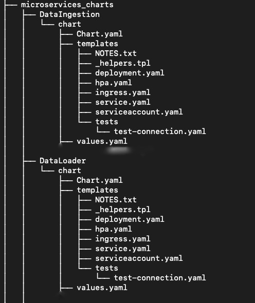
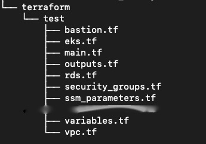
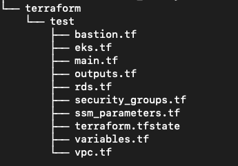
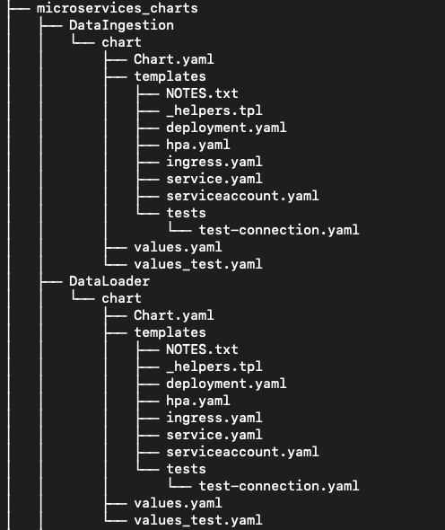
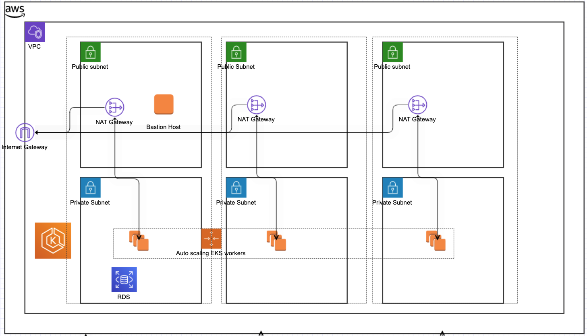

# Infra Maker

Inframaker is a script to generate terraform folders easily for different clients and multiple environments using a single command. The terraform folders contain all the necessary infrastructure components. At present, this supports only AWS but we will be supporting GCP soon.
<p>&nbsp;</p>

### How to use this to generate an environment for client

<p>&nbsp;</p>

Inframaker requires Python3 and Terraform to run

<p>&nbsp;</p>

- <p>Step 1:
    Fill up the sample aws_conf_template with appropriate values. 

    | Parameter | Sample Value | Type | Description |
    | ------ | ------ | ------ |------ |
    | TEMPLATE_ACCOUNT_ID | 438954004210 | Account | All account parameters generated on account setup per client |
    | TEMPLATE_ADMIN_ROLE | arn:aws:iam::438954004210:role/trusting-administratoraccess-role |Account |
    | TEMPLATE_ADMIN_USERNAME | trusting-administratoraccess-role | Account|
    | TEMPLATE_KMS_KEY_ID | arn:aws:kms:ap-southeast-2:438954004210:key/1d18a4d9-f831-4549-b75b-bc2457346d6a | Account|
    | TEMPLATE_BASTION_KEY_NAME | asa-atm-test-key | Account | SSH Key generated |
    |TEMPLATE_MASTER_JWT_TOKEN | ******** | Account |
    |TEMPLATE_OR_POC_DATA_S3_BUCKET | or-dot-poc-data  | Data |
    |TEMPLATE_EKS_ROLE | arn:aws:iam::438954004210:roleasa-atm-nonprod-optimalreality-graphql-servic-Role-V2N5XRTKLULA |Account | This will be terraformed soon|
    | TEMPLATE_PROFILE | default | Local AWS Profile | This is the local aws profile configured under ~/.aws |
    | TEMPLATE_REGION | ap-southeast-2 | Region | If we are doing US Client this might change along with other region parameters |
    |TEMPLATE_REGION_AMI| ami-04fcc97b5f6edcd89 | Region |  |
    | TEMPLATE_RDS_AVAILABILITY_ZONE | ap-southeast-2a | Region| |
    |TEMPLATE_REGION | ap-southeast-2 | Region | |
    | TEMPLATE_BASTION_INSTANCE_TYPE | t3.medium | Machine type| The machine types drive most of the cost |
    |TEMPLATE_EKS_CLUSTER_INSTANCE_TYPE | m5.4xlarge | Machine type | |
    | TEMPLATE_RDS_INSTANCE_CLASS | db.t3.large | Machine type| |
    |TEMPLATE_SSM_RDS_PASSWORD_VALUE | MyLongSecurePassword! | Passwords | Change this always. It is added as a SSM parameter |
    | TEMPLATE_SSM_RDS_USERNAME_VALUE | pgadmin | Other| Need not change|
    | TEMPLATE_RDS_NAME | optimalreality | Other| |
    | | | | |
    </p>
    <p>&nbsp;</p>

- Step 2 (**<1 min**):
    Run the following command to generate the terraform folder:
    <p>&nbsp;</p>

    ```sh
    $ cd ~/infra_maker
    $ python3 make.py --cloud=aws --root_dir=/tmp/tfnsw --conf_file=./aws_conf_template --client=tfnsw --env=test
    ```
    - The root_dir is the client folder with terraform and charts to be pushed to either a separate repo or a new branch where we store all client configurations (DECISION PENDING)

    - conf_file is the template filled with appropriate values

    - env is the environment name (In this example we are generating a test environment)

    <p>&nbsp;</p>

    The above command generates a folder in the root_dir whose contents would look like the following

     ```sh
    $ cd /tmp/tfnsw/ 
    $ ls
    microservices_charts	terraform
    $ cd terraform 
    $ ls  #this shows all the environment folders (we have only one now)
    test 
    $ cd ..
    $ cd microservices_charts #This has chart templates for all microservices
    $ ls
    DataIngestion		DataRecorder		Metrics			ScheduleGeneration	SimMetrics		TrafficModel		event_detection		network_model		rt_manager_service  DataLoader		EventMonitoring		RealtimeManager		SessionManager		Spatial			data_stream_ingestion	graphql_service		redis			tile38
    ```

    The tree of the folder looks like this
    
    
    

    <p>&nbsp;</p>

- Step 3 (**<15 min**):
    Go to the folder generated and apply the terraform scripts generated
    <p>&nbsp;</p>

    ```sh
    $ cd /tmp/tfnsw/terraform/test #test is the environment we have used in command 2
    $ terraform init
    $ terraform plan #check if it is throwing any errors
    $ terraform apply
    ```
    <p>&nbsp;</p>


- Step 4 (**<5 min**): check point
    <p>&nbsp;</p>
    After you apply, additional files are generated like terraform.tfstate, kubeconfig file in the environment folder (/tmp/tfnsw/terraform/test). 
    <p>&nbsp;</p>

    
    <p>&nbsp;</p>

- Step 5 (**<5 mins**): Generate values for the environment
    <p>&nbsp;</p>

    ```sh
    $ cd ~/infra_maker
    $ python3 generate_values.py --root_dir=/tmp/tfnsw --env=test --cloud=aws --client=tfnsw
    ```
    <p>&nbsp;</p>
    
    The above command genarates values_test.yaml (as env is test) for all microservices and also uses the terraform outputs to replace things like rds endpoints in the values files.

    <p>&nbsp;</p>

    

    <p>&nbsp;</p>

- Step 6 (** <5 mins **): Commit the folder

    <p>&nbsp;</p>

    The folder (root_dir) needs to be committed to a repo. This is important as it has information for all the infrastructure created using Terraform. It will be very easy to destroy the infrastructure if we have the tfstate files. Commit this directory to jl-master under client_configs directory
    <p>&nbsp;</p>


### Things to remember
<p>&nbsp;</p>

 - We have a limit of 5 VPCs per region on AWS. So we cant host all the clients in the same account in the same region.
 - The above script generates folder per environment. We need to run this thrice (prod, pre-prod, dev) for any new client with the parameters being same but changing the parameter "env" that is passed to env script.

<p>&nbsp;</p>


### Infrastructure diagrams

<p>&nbsp;</p>

## AWS
<p>&nbsp;</p>




